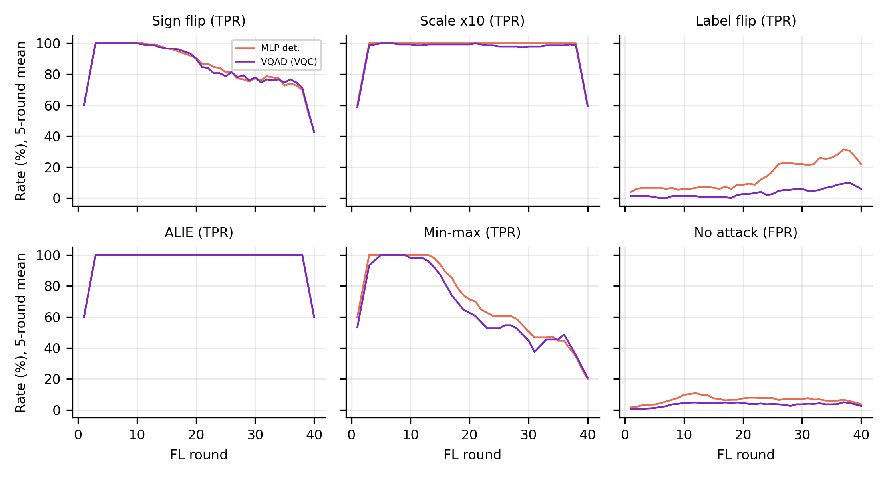
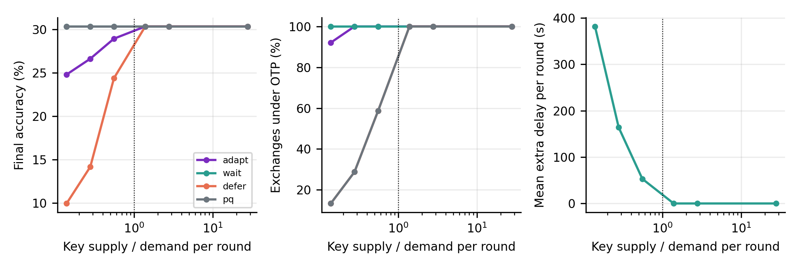

<div align="center">

# QuantumShield-Edge

### QKD-keyed hierarchical federated learning with Byzantine-aware aggregation at the edge tier

[](https://www.python.org/)
[](tests/)
[](results/)
[](#scope-stated-plainly)
[](LICENSE)
[](https://sunilgentyala.github.io/QuantumShieldEdge/)

**Sunil Gentyala** and co-authors

[Project Page](https://sunilgentyala.github.io/QuantumShieldEdge/) &nbsp;&bull;&nbsp; [Results](results/) &nbsp;&bull;&nbsp; [Reproduce](#reproduce) &nbsp;&bull;&nbsp; [Limitations](#limitations)


</div>

---

A research simulator for **QKD-keyed hierarchical federated learning** with Byzantine-aware aggregation at the edge tier.
Leaf devices train a shared model; edge aggregation nodes (EANs) aggregate their cluster and send a sealed, sparsified update
to a cloud aggregator over a link keyed from quantum key distribution (QKD); the cloud returns a sealed model delta.

> <a id="scope-stated-plainly"></a>**Scope, stated plainly.** The QKD layer is **emulated**: key bytes come from a seeded pseudo-random generator that stands in for
> QKD output, so the simulator exercises the code paths and the key arithmetic but is not by itself a cryptographic result.
> Leaf-to-EAN links are assumed to be protected by post-quantum cryptography and are **not simulated**. Experiments use CIFAR-10
> with a 24,458-parameter CNN on CPU. No claim of quantum advantage is made.

## Key results

Every number below is produced by the code in this repository and regenerated from `results/raw/` by `experiments/analyze.py`.
CIFAR-10, 50 leaves in 4 clusters, 40 rounds, 24,458-parameter CNN, 3 seeds, mean +- std of final accuracy (%).

| Aggregator | No attack | Sign flip | Min-max |
|:---|:---:|:---:|:---:|
| FedAvg | 33.1 +- 2.0 | 25.3 +- 3.1 | 21.7 +- 2.6 |
| Krum | 27.4 +- 2.6 | 25.8 +- 6.2 | 24.9 +- 3.0 |
| Trimmed mean | 31.1 +- 1.8 | 23.5 +- 4.6 | 19.7 +- 4.5 |
| MLP detector | 33.4 +- 1.4 | 31.3 +- 1.9 | 27.5 +- 6.3 |
| VQAD (4-qubit circuit) | 33.1 +- 3.9 | 31.0 +- 0.8 | 26.9 +- 4.7 |

- **Detector weighting helps under attack.** Both detectors recover several points of accuracy under sign flip and min-max
  compared with FedAvg and the robust statistics. Absolute accuracy is low because the model is tiny and training is short.
- **No in-distribution quantum advantage.** The 24-parameter circuit and a size-matched MLP perform alike on attacks seen in training.
- **Out-of-distribution, the circuit does better, but not purely because it is quantum.** In leave-one-attack-out tests over
  8 training seeds, balanced accuracy is 0.84 (circuit) vs 0.61 (MLP) and 0.40 (linear); classical controls with a trigonometric
  input encoding reach 0.71 to 0.75, so the encoding explains part of the gap and the circuit still leads.
- **The QKD cost is exact and measurable.** A link needs 76,096 key bits per round at 5% sparsity. When key supply falls to
  0.14x of demand, `adapt` keeps 92% of messages one-time-pad protected, `wait` keeps 100% at the price of delay, `defer`
  collapses to chance accuracy, and `pq` keeps accuracy but exposes most traffic to post-quantum-only protection.
- **Label flipping is not detected** by any model here (detection at chance).

<p align="center">
  
  
</p>

---

## What is real in this code

| Component | Implementation | Tests |
|---|---|---|
| Sealed messages | One-time pad + Wegman-Carter polynomial-hash tag over GF(2^61 - 1), sparse fp16 wire format, exact key accounting | round trip, tamper rejection, key cost equals wire size |
| Cloud aggregation | The cloud aggregates **only** what it decrypted and verified | pipeline test |
| QKD link model | Secret fraction (asymptotic and finite-key), key pools with atomic withdrawal, protocol-level BB84 Monte Carlo | thresholds, monotonicity, eavesdropper abort |
| Shortage policies | `adapt`, `wait`, `defer`, `pq` (explicitly counted as not information-theoretically protected) | defer and adapt tests |
| Attacks | sign flip, boosting, label flip, ALIE, min-max (omniscient) | min-max diameter constraint |
| Aggregators | FedAvg, Krum, coordinate-wise median, trimmed mean, detector-weighted | |
| Detectors | 4-qubit, 24-parameter variational circuit (exact 16x16 unitary) vs size-matched MLP, linear, and trigonometric-encoding classical controls | circuit vs PennyLane, autograd vs parameter-shift |
| Data | Dirichlet label-skew partition into 50 leaves and 4 EAN clusters | exact partition and skew |

## Install and test

```bash
pip install -r requirements.txt
python -m pytest tests -q          # 22 tests
```

CIFAR-10 is read from `data_cache/cifar-10-batches-py/` (download the python version from the dataset page and extract it there).

## Reproduce

```bash
python experiments/pretrain_detectors.py          # detector training data and weights (separate seeds)
python experiments/run_experiments.py main 4      # 126 runs: 6 aggregators x 6 attack settings x 3 seeds
python experiments/run_experiments.py keyrate 4   # key-supply sweep x 4 shortage policies
python experiments/run_experiments.py qber 4      # fixed-QBER stress and transient excursion
python experiments/run_experiments.py qevsmall 4  # transient excursion with a small pool
python experiments/run_experiments.py finitekey 4
python experiments/run_experiments.py downlink 4
python experiments/run_experiments.py sparsity 4
python experiments/run_experiments.py ablation 4
python experiments/key_analysis.py                # analytic key demand, finite-key curves, BB84 Monte Carlo, link sharing
python experiments/loo_seeds.py 8                 # leave-one-attack-out detector study over training seeds
python experiments/run_experiments.py sens 4      # 72 runs: corrupted fraction and label-skew sensitivity
python experiments/detector_studies.py noise 4    # shot noise and rotation-angle noise on the trained circuit
python experiments/detector_studies.py capacity 4 # circuit depth and MLP width sweeps
python experiments/detector_studies.py features 4 # drop one fingerprint feature
python experiments/detector_studies.py datasize 4 # fraction of training fingerprints
python experiments/detector_cost.py               # wall-clock cost of fingerprints and detector scoring
python experiments/fingerprint_figure.py          # distribution of the four fingerprint features per attack
python experiments/analyze.py                     # tables and figures into results/
```

Runs are resumable (one JSON per run in `results/raw/<suite>/`). All figures and tables in `results/` are generated from those
files. Throughput on a laptop CPU is about one FL round per second in aggregate, so the main matrix takes a few hours.

## Layout

```
qse/            package: data, model, attacks, defenses, simulator, qkd/, crypto/, vqad/
tests/          unit and integration tests
experiments/    suite definitions, runner, analysis, figure scripts
results/        raw per-run JSON, summary tables, figures
```

## Limitations

Small model and short training (about 35% accuracy for the ideal channel); few seeds for end-to-end runs; emulated QKD without
decoy-state estimation or device imperfections; a finite-key bound modeled on the structure of the tight bound, not a device
security proof; omniscient but detector-unaware attackers; reliable, ordered delivery assumed between EAN and cloud.

## License

MIT, see [LICENSE](LICENSE).
